# Objetivos
Criar uma VPC com com 2 sub-redes públicas e 2 privadas, configurar uma instância EC2 com o servidor web Nginx, criar uma página simples em html que será exibida dentro do servidor e criar um script que verifica a disponibilidade do site cada 1 minuto - caso a aplicação não esteja funcionando, o script envia uma notificação via Discord.

# Índice
- [Configuração do ambiente](#configuração-ambiente)
- [Criação da Instância EC2](#criação-da-instância-EC2)
- [Configuração do Servidor](#configuração-do-servidor)

# Configuração do ambiente

## Criar a VPC
Para criar uma VPC acesse o Console de Gerenciamento da AWS > VPC > Your VPCs > Create VPC.

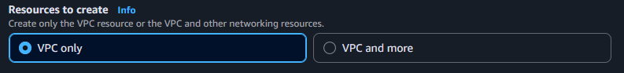

  
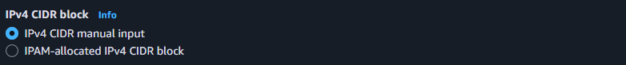

> Deixe todas as outras opções como padrão

## Criar o Internet Gateway
No painel esquerdo, clique em Internet Gateways > Create internet gateway.

Selecione o Internet Gateway criado > clique em Actions > Attach to VPC > selecione a VPC criada.

## Criar Sub-rede Pública
No painel esquerdo, clique em Subnets > Create subnet > selecione a VPC criada.

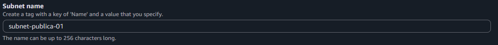

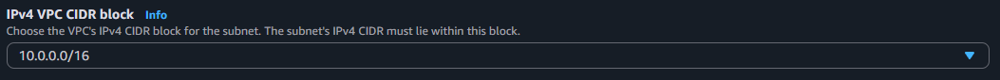

> Repita o processo para criar a segunda sub-rede alterando apenas o IPv4 Subnet CIDR Block (ex. 10.0.**2**.0/24)

## Criar Sub-rede Privada

> Repita o processo anterior alterando apenas o nome da subrede (ex. subnet-**privada**-01)

## Criar Route Table Pública
No painel esquerdo, clique em Route Tables > clique em Create route table.

Selecione a tabela criada, clique em Edit routes e crie uma nova rota com as informações a seguir:

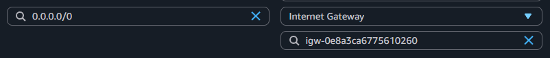

Na aba Subnet associations, clique em Edit subnet associations > selecione a(s) sub-rede(s) pública(s)

## Criar Route Table Privada

> Repita o processo anterior alterando apenas o nome da tabela de rota (ex. **Private**-Route-Table") e associando à(s) sub-rede(s) privada(s)

## Criar um Security Group
No Console AWS, vá para EC2 > Security Groups > Create Security Group.

Agora adcione Regras de Entrada (Inbound Rules) para permitir tráfego HTTP e SSH (opcional).

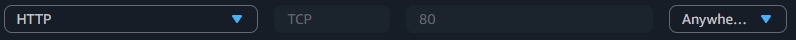

# Criação da Instância EC2
No Console AWS, vá para EC2 > Instances > Launch Instances.

Crie as seguintes tags e preencha com as informações do seu projeto:

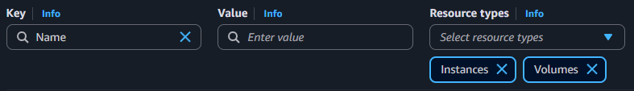 
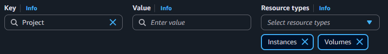 
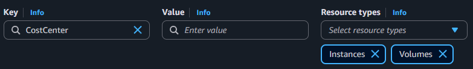 

Slecione uma imagem (AMI) Linux e uma versão LTS

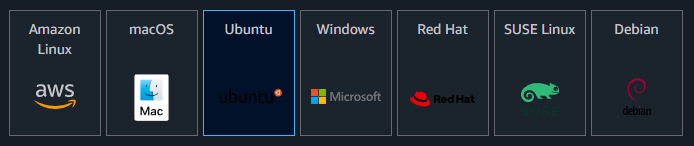

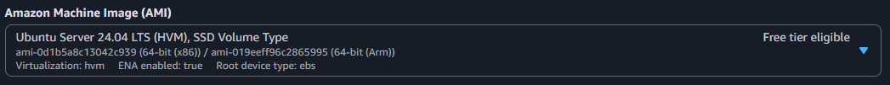

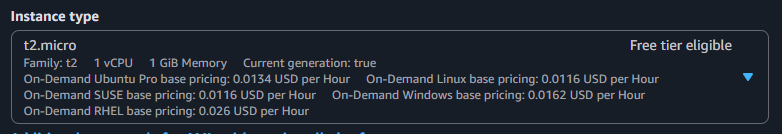

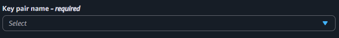
> Caso não tenha uma key pair, crie e armazene em C:\Users\seu_usuário\.ssh

Em Network Settings, clique em edit no canto superior direito > selecione a sua VPC e altere para a sub-rede pública de sua preferência:

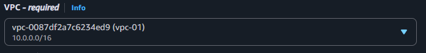

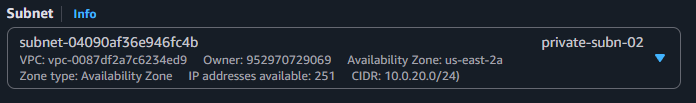

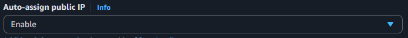

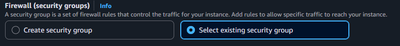

# Configuração do Servidor

>Para prosseguir faça o download do arquivo [init.sh](scripts/init.sh)

Na seção "Advanced Details", localize o campo "User data" > Choose file > selecione o arquivo instalado anteriormente:

